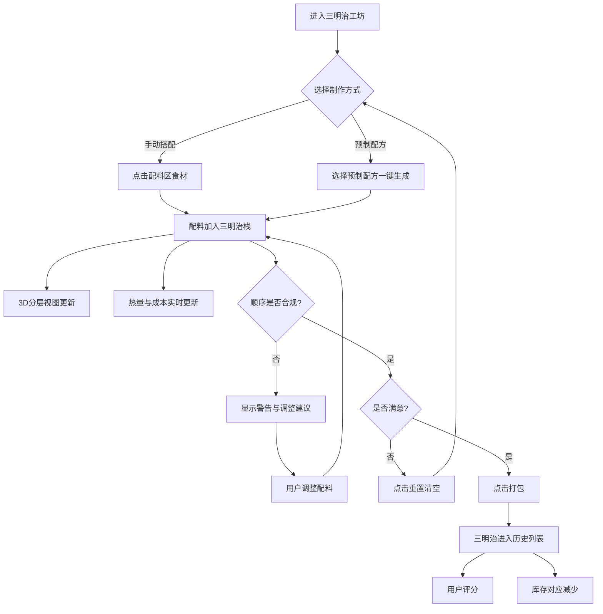

## 1. 产品概述

「三明治工坊」是一款模拟三明治流水线装配的交互式网页应用。用户从配料区选取食材，系统以 3D 分层效果实时展示三明治的叠加过程，同时实时计算热量与成本。应用融合了烹饪逻辑校验、库存管理、配方推荐和评分系统，为用户带来趣味性的三明治制作体验。

- **目标用户**：对烹饪模拟、休闲小游戏感兴趣的普通用户
- **核心价值**：在轻松有趣的交互中了解三明治搭配逻辑，体验"虚拟厨师"的成就感

## 2. 核心功能

### 2.1 功能模块

1. **配料选择区**：左侧面板展示五种配料（面包、生菜、番茄、肉饼、酱料），每种配料显示图标、名称、库存数量、热量和成本信息。点击即可添加到当前三明治。
2. **3D 分层展示区**：中央/右侧区域以 Three.js 3D 渲染实时展示三明治的分层效果，每层以不同颜色的方块代表不同配料，按点击顺序从下往上堆叠。
3. **实时数据面板**：显示当前三明治的总热量（千卡）和总成本（元），随配料增减实时更新。
4. **顺序校验提示**：系统内置三明治正确叠放规则（面包→酱料→生菜→番茄→肉饼→酱料→面包），当配料顺序不符合规范时给出提示并建议调整位置。
5. **打包与历史记录**：点击"打包"完成三明治制作，成品进入历史列表，展示制作时间、配料组成、热量和成本。
6. **评分系统**：用户可对历史三明治进行 1-5 星评分，评分持久化存储。
7. **预制配方**：提供 5 个预设配方（经典汉堡、素食三明治、双层肉饼堡、轻食三明治、豪华总汇），支持一键生成。
8. **库存管理**：每种配料有库存上限（默认 10 份），用完后变灰不可点击。提供"重置库存"按钮恢复所有库存。

### 2.2 页面详情

| 页面名称 | 模块名称 | 功能描述 |
|---------|---------|---------|
| 主页面 | 配料选择区 | 左侧面板，展示 5 种配料卡片，含图标、名称、库存数、热量、成本，点击添加到三明治 |
| 主页面 | 3D 分层展示区 | 中央/右侧 Three.js 画布，实时渲染三明治分层方块，支持鼠标拖拽旋转视角 |
| 主页面 | 实时数据面板 | 顶部或侧边显示当前三明治总热量和总成本 |
| 主页面 | 操作按钮区 | "打包"按钮完成制作，"重置"按钮清空当前三明治，"重置库存"按钮恢复库存 |
| 主页面 | 校验提示区 | 当配料顺序不正确时显示黄色/红色提示信息，包含调整建议 |
| 主页面 | 预制配方区 | 底部或弹出区展示 5 个预制配方卡片，一键生成对应三明治 |
| 主页面 | 历史记录区 | 右侧面板/底部展示已打包三明治列表，支持评分操作 |

## 3. 核心流程

用户进入页面 → 查看配料区库存 → 点击配料添加到三明治（或选择预制配方一键生成）→ 3D 视图实时更新分层效果 → 数据面板更新热量/成本 → 若顺序有误，系统提示 → 调整配料后点击"打包"→ 三明治进入历史列表 → 用户可评分。



## 4. 用户界面设计

### 4.1 设计风格

- **主色调**：暖棕色系（#8B6914 面包棕）、新鲜绿色（#4CAF50 生菜绿）、番茄红（#E53935）、芝士黄（#FFC107）
- **背景色**：浅奶油色/木纹质感底色（#FFF8F0），营造温馨厨房氛围
- **辅助色**：深棕色（#5D4037）用于文字和边框
- **字体**：标题使用 "Fredoka One"（圆润可爱风格），正文使用 "Nunito"（清晰现代）
- **按钮风格**：大圆角按钮（border-radius: 16px），带轻微阴影和悬停放大效果
- **布局风格**：左侧配料面板 + 中央 3D 视图 + 右侧历史面板的三栏布局
- **图标**：使用食材 Emoji（🍞🥬🍅🥩🧴）作为配料图标

### 4.2 页面设计概览

| 页面名称 | 模块名称 | UI 元素 |
|---------|---------|---------|
| 主页面 | 配料选择区 | 卡片式布局，每张卡片含 Emoji 图标、名称、库存进度条、热量/成本标签，悬停上浮动画 |
| 主页面 | 3D 分层展示区 | Three.js 渲染区域，柔和环境光 + 方向光，带有网格地面参考，支持 OrbitControls 旋转 |
| 主页面 | 实时数据面板 | 圆角卡片悬浮于 3D 视图上方，左侧显示🔥热量，右侧显示💰成本，数字跳动动画 |
| 主页面 | 操作按钮区 | 底部操作栏，"打包"主按钮绿色大号，"重置"灰色，"重置库存"小号文字按钮 |
| 主页面 | 校验提示区 | 顶部横幅提示条，警告时黄色背景 + ⚠️图标，正常时绿色背景 + ✅图标 |
| 主页面 | 预制配方区 | 水平滚动卡片列表，每张卡片展示配方名称、配料预览、热量/成本信息 |
| 主页面 | 历史记录区 | 右侧面板纵向列表，每条记录含名称、时间戳、配料标签、星级评分组件 |

### 4.3 响应式设计

- 桌面端优先：1920px 三栏布局，1440px 两栏布局，1024px 以下配料区折叠为底部抽屉
- 移动端适配：配料区变为底部弹出面板，3D 视图占满屏幕，历史记录为可滑动底部 Sheet

### 4.4 3D 场景指南

- **环境与氛围**：温暖厨房色调，柔和的暖色环境光模拟室内照明
- **光照设置**：环境光（ambientLight，强度 0.4）+ 主方向光（directionalLight，强度 0.8）+ 补光（pointLight，强度 0.3）
- **相机设置**：透视相机，初始角度从斜上方 45° 观察，OrbitControls 支持旋转/缩放，限制缩放范围
- **构图与焦点**：三明治居中叠放，每层方块带圆角效果（RoundedBoxGeometry），层与层之间略有间隙
- **交互与动画**：添加配料时方块从上方掉入动画，打包时三明治缩小消失动画
- **后期效果**：可选 bloom 辉光效果增强视觉吸引力
- **性能预算**：保持 60fps，面数控制在 5000 以内
```

## 5. 配料规则与数据

### 5.1 配料数据

| 配料 | 图例颜色 | 热量(千卡) | 成本(元) | 初始库存 |
|------|---------|-----------|---------|---------|
| 面包 🍞 | #DEB887 | 80 | 2.0 | 10 |
| 生菜 🥬 | #81C784 | 5 | 0.5 | 10 |
| 番茄 🍅 | #EF5350 | 15 | 1.0 | 10 |
| 肉饼 🥩 | #8D6E63 | 250 | 5.0 | 10 |
| 酱料 🧴 | #FFCC80 | 30 | 1.5 | 10 |

### 5.2 正确叠放顺序

正确的三明治叠放顺序（从下到上）：**面包 → 酱料 → 生菜 → 番茄 → 肉饼 → 酱料 → 面包**

### 5.3 预制配方

| 配方名称 | 配料组合 | 总热量 | 总成本 |
|---------|---------|-------|-------|
| 经典汉堡 | 面包→酱料→生菜→番茄→肉饼→酱料→面包 | 490千卡 | 13.5元 |
| 素食三明治 | 面包→酱料→生菜→番茄→生菜→酱料→面包 | 245千卡 | 8.0元 |
| 双层肉饼堡 | 面包→酱料→生菜→肉饼→番茄→肉饼→酱料→面包 | 775千卡 | 20.0元 |
| 轻食三明治 | 面包→生菜→番茄→生菜→面包 | 185千卡 | 6.0元 |
| 豪华总汇 | 面包→酱料→生菜→番茄→肉饼→酱料→生菜→番茄→面包 | 610千卡 | 17.5元 |

## 6. 数据存储

所有数据使用浏览器 localStorage 持久化存储：
- `sandwich_history`：历史三明治列表（含配料、时间戳、评分）
- `sandwich_inventory`：当前库存状态
- `sandwich_current`：当前正在制作的三明治状态（刷新恢复）