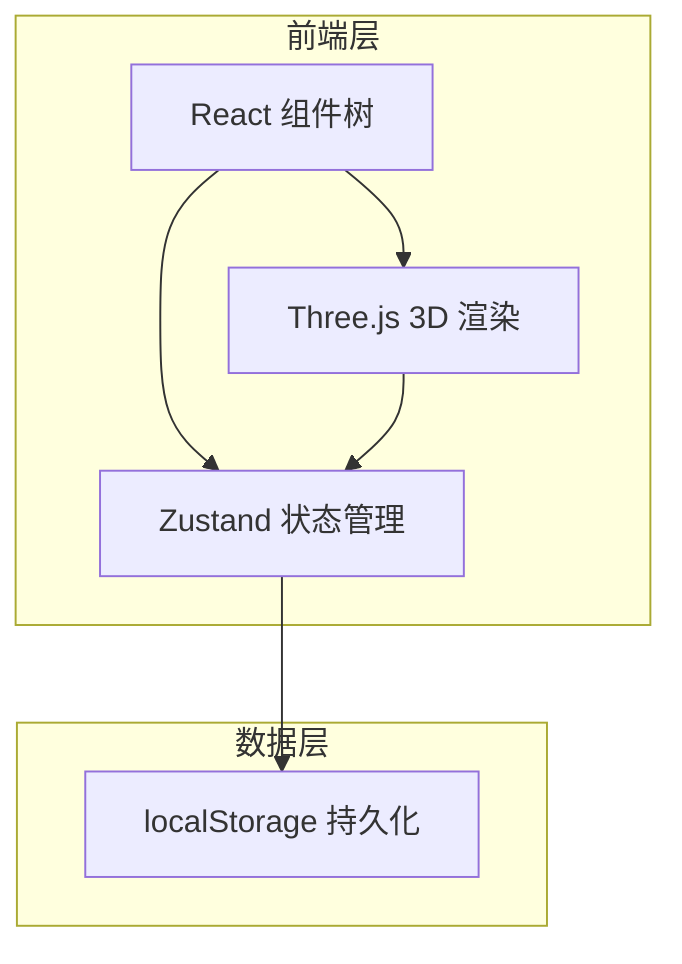

## 1. 架构设计

本应用为纯前端单页应用（SPA），无需后端服务。所有数据通过浏览器 localStorage 持久化。



## 2. 技术选型

- **前端框架**：React@18 + TypeScript
- **构建工具**：Vite
- **样式方案**：Tailwind CSS
- **状态管理**：Zustand
- **3D 渲染**：Three.js（直接使用 three 库，通过 useRef + useEffect 控制 canvas）
- **图标库**：lucide-react
- **初始化工具**：vite-init（react-ts 模板）
- **数据持久化**：localStorage

## 3. 路由定义

本应用为单页应用，仅有一个路由：

| 路由 | 用途 |
|------|------|
| / | 三明治工坊主页面 |

## 4. 组件树结构

```
App
├── Header（应用标题 + 实时数据面板）
├── SandwichWorkspace
│   ├── IngredientPanel（配料选择区）
│   │   ├── IngredientCard × 5（配料卡片）
│   │   └── ResetInventoryButton
│   ├── Sandwich3DView（3D 分层展示区）
│   │   └── canvas（Three.js 渲染）
│   └── ControlBar（操作按钮区）
│       ├── PackButton（打包按钮）
│       ├── ResetButton（重置按钮）
│       └── ValidationTip（校验提示）
├── RecipePanel（预制配方区）
│   └── RecipeCard × 5
└── HistoryPanel（历史记录区）
    └── HistoryItem × N（含评分组件）
```

## 5. 数据模型

### 5.1 Zustand Store 设计

```typescript
interface Ingredient {
  id: string;
  name: string;
  emoji: string;
  color: string;
  calories: number;
  cost: number;
  stock: number;
  maxStock: number;
}

interface SandwichLayer {
  ingredientId: string;
  order: number;
}

interface PackedSandwich {
  id: string;
  name: string;
  layers: SandwichLayer[];
  totalCalories: number;
  totalCost: number;
  rating: number;
  createdAt: string;
}

interface SandwichStore {
  ingredients: Ingredient[];
  currentLayers: SandwichLayer[];
  history: PackedSandwich[];
  validationError: string | null;
  
  addIngredient: (id: string) => void;
  removeIngredient: (index: number) => void;
  resetCurrent: () => void;
  packSandwich: (name: string) => void;
  rateSandwich: (id: string, rating: number) => void;
  resetInventory: () => void;
  applyRecipe: (recipe: Recipe) => void;
}
```

### 5.2 配方数据模型

```typescript
interface Recipe {
  id: string;
  name: string;
  description: string;
  ingredientIds: string[];
  totalCalories: number;
  totalCost: number;
}
```

### 5.3 localStorage 存储结构

| Key | 类型 | 说明 |
|-----|------|------|
| sandwich_inventory | Ingredient[] | 配料库存状态 |
| sandwich_history | PackedSandwich[] | 历史三明治列表 |

## 6. Three.js 3D 场景配置

- **场景元素**：
  - 每层配料用 `BoxGeometry` 表示，尺寸约 2.0 × 0.15 × 1.2（宽×高×深）
  - 使用 `MeshStandardMaterial` 配合对应颜色
  - 层间距 0.05，从 y=0 向上堆叠
- **光照**：
  - `AmbientLight(0xffffff, 0.4)`
  - `DirectionalLight(0xffffff, 0.8)` 位置 (5, 5, 5)
  - `PointLight(0xffffff, 0.3)` 位置 (-3, 3, -3)
- **相机**：
  - `PerspectiveCamera(45, aspect, 0.1, 100)`
  - 初始位置 (4, 3, 5)，看向 (0, 0.5, 0)
- **控制器**：
  - `OrbitControls`，限制缩放 2-10，限制垂直旋转角度
- **动画**：
  - 添加配料时：方块从 y=2 缓动下落到目标位置
  - 打包时：整体缩小 + 透明度渐变消失

## 7. 校验逻辑

三明治叠放规则（数组索引 0 = 底层）：
```
[面包] → [酱料] → [生菜] → [番茄] → [肉饼] → [酱料] → [面包]
```

校验逻辑：
1. 第一层必须是面包
2. 最后一层必须是面包
3. 肉饼不能出现在最上层（最上层为面包时除外）
4. 肉饼上方如还有配料（非面包），发出建议
5. 检测是否有重复/不合理的相邻叠放

校验结果以 `validationError` 状态存储，组件中以提示条形式展示。